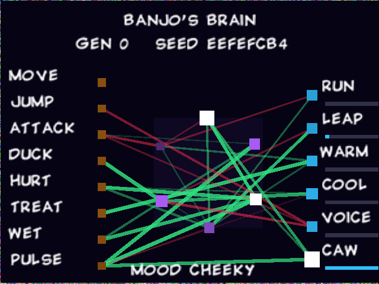
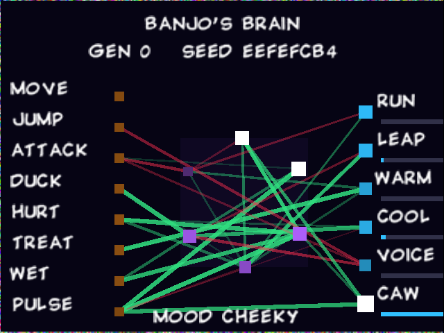
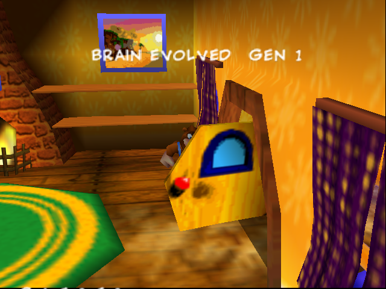
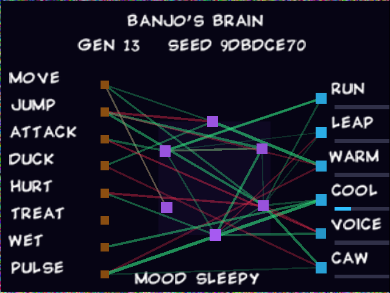

# Banjo-Kazooie: Banjo's Brain

A Banjo-Kazooie ROM hack that puts a tiny, evolving brain inside the game. It's a spiking graph
neural network: it watches how you play, nudges Banjo and Kazooie in return, and rewires itself
over time. The brain is saved on the cartridge, so every copy of the game grows a different one.
You can watch it think from a new **VIEW BRAIN** entry in the pause menu.

Built on the [n64decomp/banjo-kazooie](https://github.com/n64decomp/banjo-kazooie) decompilation.
It's a separate hack from the Malevolent Shrine one in this repo.



## Seeing it

Pause, push the stick down past **SAVE AND QUIT** to **VIEW BRAIN**, and press **A**. B, A or Start goes back.

* **Orange squares** on the left are the 8 sensory neurons, **purple** in the middle are the 6 hidden
  neurons, and **blue** on the right are the 6 motor neurons.
* **Lines** are the 36 synapses: green ones excite and red ones inhibit, and thicker lines are stronger.
  A neuron flashes **white** when it fires, and its outgoing synapses light up as the spike travels.
* The bars next to the motor neurons show how active each one is. **MOOD** names the most active one
  (RESTLESS, BOUNCY, HAPPY, CALM, CHATTY, CHEEKY, or SLEEPY when nothing stands out).
* **GEN** is how many times it has evolved. **SEED** is this brain's unique identity.

The game is frozen while paused, so the brain "dreams" in the viewer: it keeps firing on its own
rhythm, but it doesn't learn.



## How it works

**Senses (inputs):**

| neuron | fires when |
|---|---|
| MOVE | you push the stick (stronger the further you push) |
| JUMP / ATTACK | you press A / B |
| DUCK | you hold Z |
| HURT | Banjo loses health |
| TREAT | you collect notes, jiggies, honeycombs, Mumbo tokens or eggs |
| WET | Banjo is in water |
| PULSE | a built-in 1.3 Hz heartbeat that keeps the brain ticking |

**Actions (outputs)**, all deliberately small so the game stays fair:

| neuron | effect |
|---|---|
| RUN | Banjo's run speed, 94%–110% |
| LEAP | upward launch strength, 98%–106% |
| WARM / COOL | tints Banjo toward orange or blue |
| VOICE | Banjo occasionally says something; each brain has a favorite line |
| CAW | Kazooie occasionally squawks |

**The network:** 20 neurons on a directed graph. Every hidden and motor neuron listens to 3 others,
and hidden neurons also listen to each other, so it has loops. Each game frame is one round of
**message passing** over the graph (the graph-neural-network part): every synapse carries its source's
spike, plus a faint echo of its recent activity, scaled by the synapse's weight. Each neuron is a
**leaky integrate-and-fire** spiking neuron with an adaptive threshold that rises when it fires and
slowly relaxes, which keeps activity balanced.

**Learning, like a brain:**

* **STDP (spike-timing-dependent plasticity):** when a synapse's input fires just before its target
  fires, the synapse is marked; the reverse order marks it the other way.
* **Dopamine:** collecting things releases reward and getting hurt releases punishment. Dopamine turns
  the marked synapses into lasting weight changes, so the brain learns what goes with good and bad moments.
* **Evolution:** after enough reward (or 2.5 minutes of play) the brain moves to a new generation and shows
  "BRAIN EVOLVED GEN n". Some synapses are pruned and regrown from different neurons, so the wiring
  itself changes (structural plasticity).



**Personal to each copy:** a new brain is seeded from the exact CPU cycle of your first input, so no two
brains start the same. Everything is saved in 24 bytes of the save chip that the game never uses (padding
in the cartridge-wide global save block). That's a 32-bit seed, a 16-bit generation counter, and the
36 synapse weights at 4 bits each. The current wiring doesn't need to be stored: each synapse regrows on
its own fixed schedule, so the wiring can be recalculated from the seed and generation. The brain saves
when it evolves and every 90 seconds. Because it lives in the global block and not a save file, it belongs
to the cartridge and survives starting new games.



## Playing it: apply the patch

`patch/banjo-kazooie-brain.bps` applies to your own dump of **Banjo-Kazooie (USA) v1.0**:

| | SHA-1 |
|---|---|
| original ROM (`.z64`, big-endian) | `1fe1632098865f639e22c11b9a81ee8f29c75d7a` |
| patched ROM | `63f5dd31da21264ed73eac61c91f772529dfcb4d` |

Use any BPS patcher, such as [Floating IPS](https://www.smwcentral.net/?p=section&a=details&id=11474)
or [Rom Patcher JS](https://www.marcrobledo.com/RomPatcher.js/). Your emulator needs a working 4 Kbit
EEPROM save (the same save type the original game uses) for the brain to persist. No ROMs are included in this repository.

## Building from source

```sh
git clone --recursive https://github.com/n64decomp/banjo-kazooie   # tested at e8d31fa5
cd banjo-kazooie
# follow its README once: install packages, create .venv, add baserom.us.v10.z64, then run `make`
/path/to/this/repo/banjo-kazooie-brain/decomp/apply_mod.sh "$PWD" banjo-brain.z64
```

On a fresh clone this reproduces the patched ROM's SHA-1 exactly.

| file | change |
|---|---|
| `src/core2/brain.inc` (new) | the whole brain: network, senses, learning, evolution, saving and the viewer |
| `src/core2/bsmethods.c` | includes the brain (so it builds into the `core2` overlay) and updates it every frame with the player |
| `src/core2/ba/physics.c` | RUN scales Banjo's target speed; LEAP scales upward launches |
| `src/core2/code_12F30.c` | WARM / COOL tint Banjo's model color |
| `src/core2/gc/pauseMenu.c` | the VIEW BRAIN entry: selecting it, opening and closing the viewer, hiding the menu under it |
| `src/core2/code_5C870.c` | draws the viewer over the pause screen and hides the HUD while it's open |
| `include/functions.h` | prototypes |

## Testing

Tested in mupen64plus with the headless harness in `../banjo-kazooie-malevolent-shrine/emu/`.
Test builds (`#define BRAIN_TEST`) evolve every 20 seconds and show a debug readout.

* **Viewer and menu:** the entry appears under SAVE AND QUIT, A opens the live network, and B returns.
* **Evolution:** a fresh brain showed "BRAIN EVOLVED" for GEN 1, 2 and 3 while Banjo moved around his house
  ([screenshots/evolving.jpg](screenshots/evolving.jpg)).
* **Persistence:** after a reboot, the viewer showed the same seed, generation and wiring as before.
* **Personalization:** separate runs grew brains with different seeds and different wiring.
* **Full playthrough:** the release ROM boots and plays normally from power-on through the new-game intro
  into Spiral Mountain, and the brain viewer works there ([screenshots/playthrough.jpg](screenshots/playthrough.jpg)).
* `tools/brain_sim.py` mirrors the network in Python. I used it to tune the neuron parameters so the
  brain is lively but not saturated.

## Limitations

* Tested only in mupen64plus, not on real hardware or other emulators.
* Deleting or resetting the save chip (or an emulator's save file) gives you a new brain.
* The brain's effects are subtle by design. The fun is mostly in watching it and hearing it talk.
