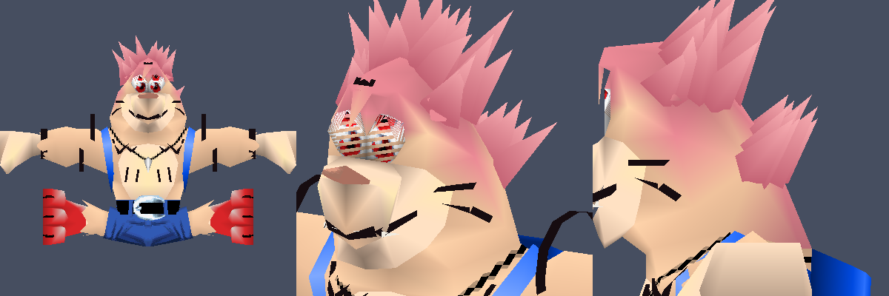
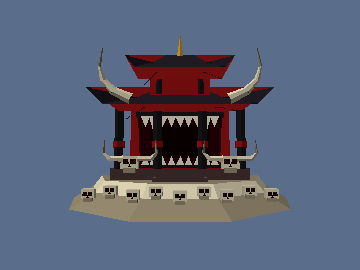

# Banjo-Kazooie: Domain Expansion – Malevolent Shrine

A Banjo-Kazooie ROM hack that turns Banjo into Sukuna from *Jujutsu Kaisen* and lets him use
Domain Expansion: Malevolent Shrine.
It's built on the [n64decomp/banjo-kazooie](https://github.com/n64decomp/banjo-kazooie) decompilation.


## Sukuna-Banjo

Banjo's player model is converted into Sukuna:

* **Face:** the bear snout is flattened into a human face with a small nose, and the bear ears are tucked away.
  He has red eyes, Sukuna's second pair of eyes under them, black cheek stripes, a forehead mark and a toothy grin.
* **Hair:** pink and spiky, swept up and back. It's new geometry attached to his head bone, so it moves with him.
* **Markings:** jagged marks on the chest, lines down the stomach, two black bands on each upper arm and one on each wrist.
* **Outfit:** skin-toned instead of fur, dark-blue jeans for the yellow shorts, a brown belt, and red sneakers for his feet.

Both player models are converted (the low-poly one used in the big levels and the high-poly one used in
smaller areas), at every level of detail. Kazooie is unchanged.



## In game

Press **L** while standing or walking as Banjo. It doesn't work when transformed, in water or while sliding.

1. Banjo stops and turns to the camera. Kazooie ducks into the backpack, and Banjo makes the
   **hand sign** with elbows out and hands pressed together in front of his chest. This is a new
   animation made for the mod.
2. The camera cuts to a close-up and the level music drops away. Black bars slide in, and
   **"DOMAIN EXPANSION"** appears in the top bar with a thunderclap.
3. With a rumble, the **shrine** rises up behind Banjo while the camera pulls back to show all of it:
   a two-tier red-and-black temple with huge horns, a gaping maw of teeth, and horned cow skulls on a
   mound of bones and skulls. **"MALEVOLENT SHRINE"** appears in the bottom bar and the screen turns blood red.
4. For about 3.5 seconds, slashes streak across the screen (Dismantle and Cleave) with swipe sounds.
   Every enemy within 2500 units gets cut down. Each sweep counts as a different attack (Beak Bomb,
   Beak Buster, Beak Barge, Roll, Claw, Peck, fast-fall), so enemies that only die to specific moves
   still get hit. Defeated enemies drop honeycombs as usual.
5. When the domain ends, the shrine and the red fade away and the camera returns to normal. Banjo is back
   to idle about 7 seconds after he started. He can't be hurt while the domain is active.

 

## Playing it: apply the patch

`patch/banjo-kazooie-malevolent-shrine.bps` applies to your own dump of **Banjo-Kazooie (USA) v1.0**:

| | SHA-1 |
|---|---|
| original ROM (`.z64`, big-endian) | `1fe1632098865f639e22c11b9a81ee8f29c75d7a` |
| patched ROM | `00fb00dcf0e209ad4f4cf42b958bf38aa7f0b03b` |

Use any BPS patcher, such as [Floating IPS](https://www.smwcentral.net/?p=section&a=details&id=11474)
or [Rom Patcher JS](https://www.marcrobledo.com/RomPatcher.js/), then play the result in an emulator.
No ROMs are included in this repository.

## Building from source

The mod is a small patch to the decomp, two new assets (the animation and the shrine model), and a
conversion of Banjo's own models, which the install script runs on your extracted game files.

```sh
git clone --recursive https://github.com/n64decomp/banjo-kazooie   # tested at e8d31fa5
cd banjo-kazooie
# follow its README once: install packages, create .venv, add baserom.us.v10.z64, then run `make`
/path/to/this/repo/banjo-kazooie-malevolent-shrine/decomp/apply_mod.sh "$PWD" banjo-shrine.z64
```

`apply_mod.sh` applies `decomp/malevolent-shrine.patch` and puts the new assets in unused slots of
the asset table: animation `0x0004` and model `0x02D8`. It converts Banjo's models `0x34E` and `0x34D`
with `tools/sukuna.py`, keeping the originals as `*.orig` (it installs `numpy` into the decomp's `.venv` if needed). It then rebuilds with `ANTI_TAMPER=0 ANTI_PIRACY=0`,
because the game's anti-tamper checks otherwise misbehave on modified code. On a fresh clone it
reproduces the patched ROM's SHA-1 exactly.

### What the patch changes

| file | change |
|---|---|
| `src/core2/bs/malevolent_shrine.inc` (new) | the whole move: player state, timeline, camera pull-back, shrine placement and fading, attack sweeps, sounds, text and the 2D overlay |
| `src/core2/bs/jig.c` | `#include`s the file above, so it builds into the `core2` overlay without touching the splat layout |
| `include/enums.h` | new player state `BS_A6_MALEVOLENT_SHRINE`, assets `ASSET_4_ANIM_BSSHRINE` and `ASSET_2D8_MODEL_MALEVOLENT_SHRINE` |
| `src/core2/bsList.c`, `bsmethods.c` | state table grows from 166 to 167 entries and registers the new state |
| `src/core2/bs/stand.c`, `walk.c` | L starts the move from idle or walking |
| `src/core2/ba/model.c` | draws the shrine just before Banjo |
| `src/core2/nc/dynamicCamC.c` | the Jiggy close-up camera gets an adjustable look-at height (defaults to the original 100) so the domain can pull it back and tilt it up |
| `src/core2/code_6B30.c` | during a sweep, the player's active hitbox is the attack the domain is imitating |
| `src/core2/code_7060.c` | the move counts as an uninterruptible state, like the Jiggy dance |
| `src/core2/code_5C870.c` | draws the domain overlay after the 3D world and before the HUD |
| `include/functions.h`, `include/bs_funcs.h` | prototypes |

### How the shrine is drawn

The shrine is a real N64 model in the game's own format (`decomp/assets/model/02D8.model.bin`,
749 triangles, vertex colors only). It's drawn through the game's model renderer right after the level's
solid geometry and just before Banjo, with depth testing off. So it paints over the scenery like a
backdrop (the domain replaces the surroundings), and Banjo and the enemies are drawn in front of it.
It's placed 1600 units behind Banjo on the far side from the camera, scaled 1.5×, and it rises and fades in
over 0.7 seconds. The close-up camera glides from 290 to 1100 units away so the whole shrine fits between
the black bars.

## Tools

`tools/` holds the Python that produced the new assets:

* `sukuna.py` converts Banjo's models into Sukuna. It recolors vertex colors and texture palettes, and
  reshapes the head vertices (the snout lives on its own bone, so it is squashed back to the face and its pivot moved).
  It adds hair spikes, arm bands and markings as new display lists hooked into each level of detail under the right bone.
  Markings are drawn in a flat front view and projected onto the mesh by ray casting.
* `bkmodel.py` reads models: textures, display lists, vertices and the geometry command tree (including the
  three levels of detail). `render2.py` is a depth-buffered, textured software renderer used to preview the changes.

* `make_shrine.py` builds the shrine model (temple, maw, pillars, roofs, horns, skull mound) and writes it in
  Banjo-Kazooie's model format: header, empty texture list, display list, vertex list and one geometry command.
  With a second argument it also renders a preview image.
* `bkparse.py` reads Banjo's skeleton (model `0x34E`) and animation files.
* `pose.py` does forward kinematics using the engine's bone math (Euler order, pivot-relative transforms)
  and renders stick-figure previews.
* `solve.py` / `design.py` search for arm angles that bring the hands together in front of the chest.
* `make_anim.py` writes the hand-sign animation. It starts from frame 0 of the idle animation (legs, head,
  Kazooie hidden in the backpack), raises the arms into the sign over 10 frames, holds, then releases.
  Set `BK_ASSETS=/path/to/banjo-kazooie/assets` so it can find the extracted game assets.

 

## Testing

`emu/` has the harness used to check the hack in mupen64plus:

* `scriptinput.c` is a mupen64plus input plugin that replays a scripted button timeline.
* `run.sh` runs the emulator headless (Xvfb, Rice video plugin), takes screenshots at chosen
  frames and builds a contact sheet.
* `build_test_rom.sh` builds test ROMs that boot straight into a level. With `SHRINE_TEST=1` they also spawn a
  ring of Grublins and show a live `ALIVE` counter and camera readout. That code is behind
  `#ifdef SHRINE_TEST` and is not in the release ROM.

Results:

* Without the domain, six Grublins knock Banjo out
  ([screenshots/test-control-no-domain.jpg](screenshots/test-control-no-domain.jpg)). With it, all six
  are cut down in front of the shrine and drop honeycombs, and Banjo takes no damage
  ([screenshots/test-with-domain.jpg](screenshots/test-with-domain.jpg)).
* The release ROM boots and plays normally from power-on through the new-game intro into Spiral Mountain.
  There the move triggers repeatedly without problems, and the shrine appears and disappears each time
  ([screenshots/playthrough-repeated-use.jpg](screenshots/playthrough-repeated-use.jpg)).

## Limitations

* Tested only in mupen64plus, not on real hardware or other emulators.
* The shrine is a backdrop: it covers the scenery behind Banjo, but characters and effects drawn after
  him (enemies, some NPCs) appear in front of it even when they are actually behind it.
* In tight spaces the pulled-back camera can end up against walls.
* A few cutscenes use separate Banjo models (for example, Banjo asleep in bed in the intro), so he is still a bear there.
* Sukuna-Banjo is still built on Banjo's skeleton, so he keeps Banjo's proportions and round head.
* It hits anything the game treats as attackable within range, including things a Beak Bomb or
  Beak Buster would break. Bosses and scripted enemies may react oddly.
* There is no cooldown or cost, so it can be used as often as you like.
