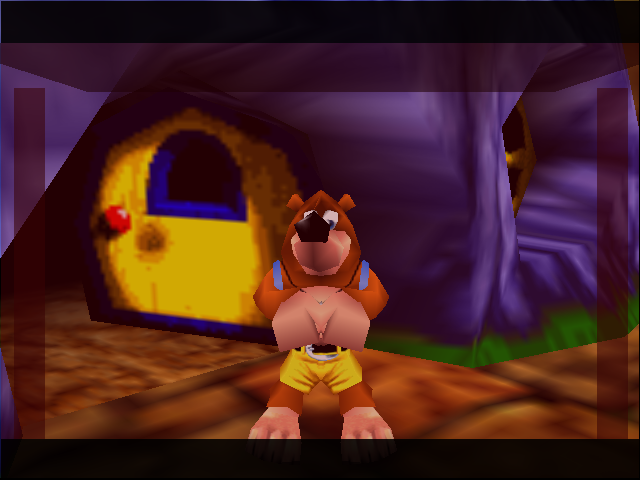
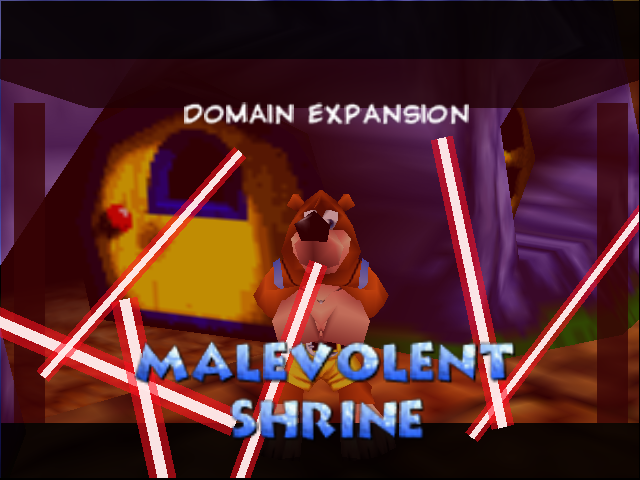
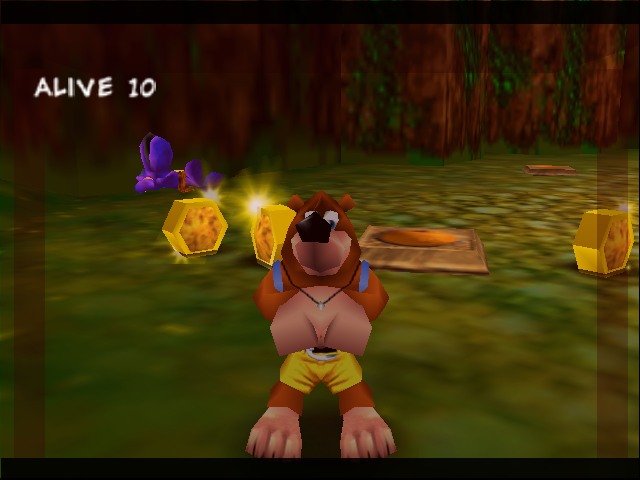
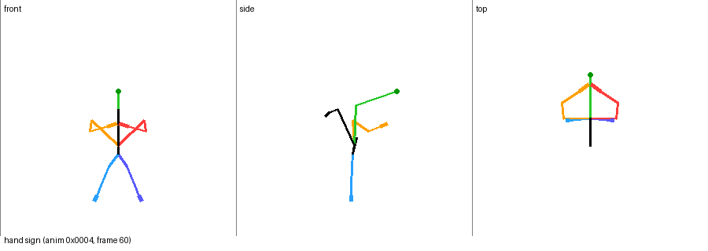

# Banjo-Kazooie: Domain Expansion – Malevolent Shrine

A Banjo-Kazooie ROM hack that lets Banjo use Sukuna's Domain Expansion from *Jujutsu Kaisen*.
It's built on the [n64decomp/banjo-kazooie](https://github.com/n64decomp/banjo-kazooie) decompilation.

 

## In game

Press **L** while standing or walking as Banjo. It doesn't work when transformed, in water or while sliding.

1. Banjo stops and turns to the camera. Kazooie ducks into the backpack, and Banjo makes the
   **hand sign** with elbows out and hands pressed together in front of his chest. This is a new
   animation made for the mod.
2. The camera cuts to a close-up, the level music drops away, and the screen darkens as the shrine closes in:
   a blood-red wash, black cinematic bars, and a dark eave and pillars framing the screen.
3. **"DOMAIN EXPANSION"** appears with a thunderclap, then **"MALEVOLENT SHRINE"**.
4. For about 3.5 seconds, slashes streak across the screen (Dismantle and Cleave) with swipe sounds.
   Every enemy within 2500 units gets cut down. Each sweep counts as a different attack (Beak Bomb,
   Beak Buster, Beak Barge, Roll, Claw, Peck, fast-fall), so enemies that only die to specific moves
   still get hit. Defeated enemies drop honeycombs as usual.
5. The domain fades, and Banjo relaxes back to idle about 7 seconds after it started. He can't be hurt while it's active.



## Playing it: apply the patch

`patch/banjo-kazooie-malevolent-shrine.bps` applies to your own dump of **Banjo-Kazooie (USA) v1.0**:

| | SHA-1 |
|---|---|
| original ROM (`.z64`, big-endian) | `1fe1632098865f639e22c11b9a81ee8f29c75d7a` |
| patched ROM | `02cc4eabae2bae402acc0a5cf1fe36be28f6fea9` |

Use any BPS patcher, such as [Floating IPS](https://www.smwcentral.net/?p=section&a=details&id=11474)
or [Rom Patcher JS](https://www.marcrobledo.com/RomPatcher.js/), then play the result in an emulator.
No ROMs are included in this repository.

## Building from source

The mod is a small patch to the decomp plus one new animation asset.

```sh
git clone --recursive https://github.com/n64decomp/banjo-kazooie   # tested at e8d31fa5
cd banjo-kazooie
# follow its README once: install packages, create .venv, add baserom.us.v10.z64, then run `make`
/path/to/this/repo/banjo-kazooie-malevolent-shrine/decomp/apply_mod.sh "$PWD" banjo-shrine.z64
```

`apply_mod.sh` applies `decomp/malevolent-shrine.patch` and copies the animation into the asset
table's unused slot `0x0004`. It then rebuilds with `ANTI_TAMPER=0 ANTI_PIRACY=0`, because the game's
anti-tamper checks otherwise misbehave on modified code. On a fresh clone it reproduces the patched ROM's SHA-1 exactly.

### What the patch changes

| file | change |
|---|---|
| `src/core2/bs/malevolent_shrine.inc` (new) | the whole move: player state, timeline, attack sweeps, sounds, text and the 2D overlay drawing |
| `src/core2/bs/jig.c` | `#include`s the file above, so it builds into the `core2` overlay without touching the splat layout |
| `include/enums.h` | new player state `BS_A6_MALEVOLENT_SHRINE`, animation `ASSET_4_ANIM_BSSHRINE` |
| `src/core2/bsList.c`, `bsmethods.c` | state table grows from 166 to 167 entries and registers the new state |
| `src/core2/bs/stand.c`, `walk.c` | L starts the move from idle or walking |
| `src/core2/code_6B30.c` | during a sweep, the player's active hitbox is the attack the domain is imitating |
| `src/core2/code_7060.c` | the move counts as an uninterruptible state, like the Jiggy dance |
| `src/core2/code_5C870.c` | draws the domain overlay after the 3D world and before the HUD |
| `include/functions.h`, `include/bs_funcs.h` | prototypes |

## How the hand sign was made

`tools/` holds the Python that produced `decomp/assets/anim/0004.anim.bin`:

* `bkparse.py` reads Banjo's skeleton (model `0x34E`) and animation files.
* `pose.py` does forward kinematics using the engine's bone math (Euler order, pivot-relative transforms)
  and renders stick-figure previews.
* `solve.py` / `design.py` search for arm angles that bring the hands together in front of the chest.
* `make_anim.py` writes the animation. It starts from frame 0 of the idle animation (legs, head,
  Kazooie hidden in the backpack), raises the arms into the sign over 10 frames, holds, then releases.
  Set `BK_ASSETS=/path/to/banjo-kazooie/assets` so it can find the extracted game assets.



## Testing

`emu/` has the harness used to check the hack in mupen64plus:

* `scriptinput.c` is a mupen64plus input plugin that replays a scripted button timeline.
* `run.sh` runs the emulator headless (Xvfb, Rice video plugin), takes screenshots at chosen
  frames and builds a contact sheet.
* `build_test_rom.sh` builds test ROMs that boot straight into a level. With `SHRINE_TEST=1` they also spawn a
  ring of Grublins and show a live `ALIVE` counter. That code is behind `#ifdef SHRINE_TEST` and is not in the release ROM.

Results:

* Without the domain, six Grublins knock Banjo out
  ([screenshots/test-control-no-domain.jpg](screenshots/test-control-no-domain.jpg)). With it, all six
  are cut down and drop honeycombs, and Banjo takes no damage
  ([screenshots/test-with-domain.jpg](screenshots/test-with-domain.jpg)).
* The release ROM boots and plays normally from power-on through the new-game intro into Spiral Mountain,
  and the move triggers repeatedly there without problems
  ([screenshots/playthrough-repeated-use.jpg](screenshots/playthrough-repeated-use.jpg)).

## Limitations

* Tested only in mupen64plus, not on real hardware or other emulators.
* It hits anything the game treats as attackable within range, including things a Beak Bomb or
  Beak Buster would break. Bosses and scripted enemies may react oddly.
* There is no cooldown or cost, so it can be used as often as you like.
